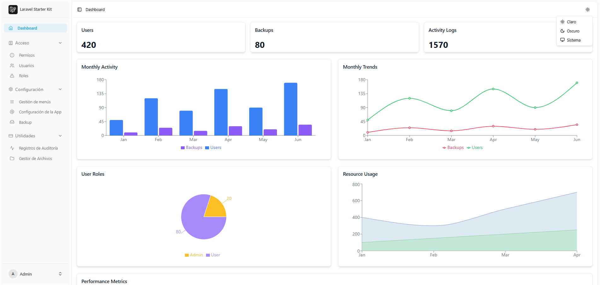
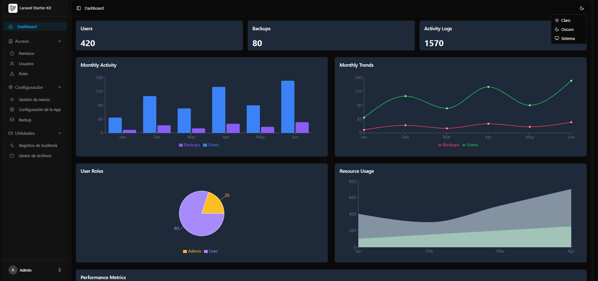
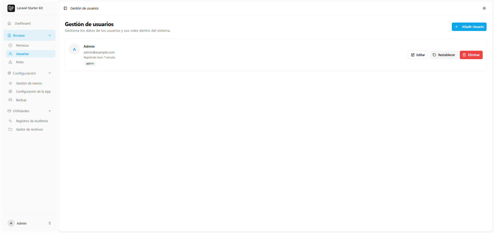
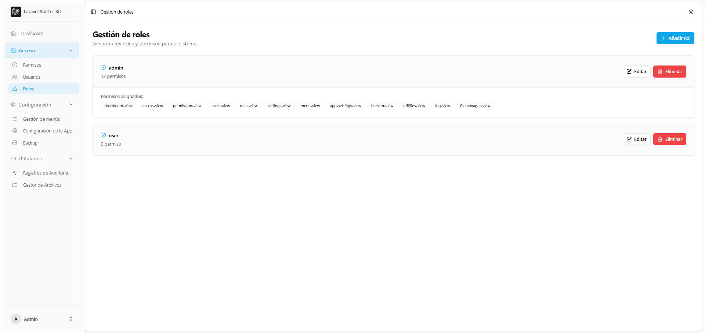
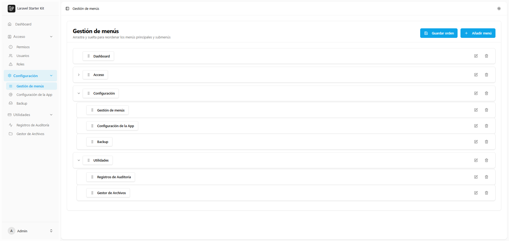
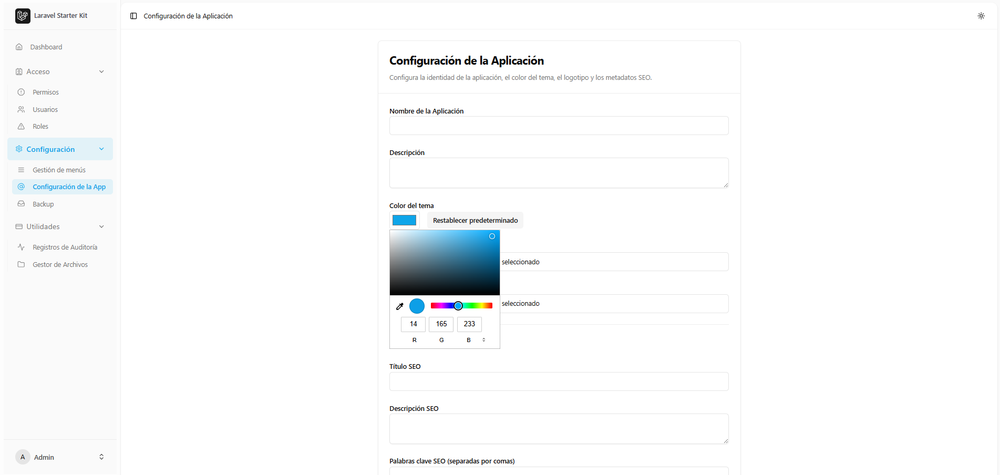
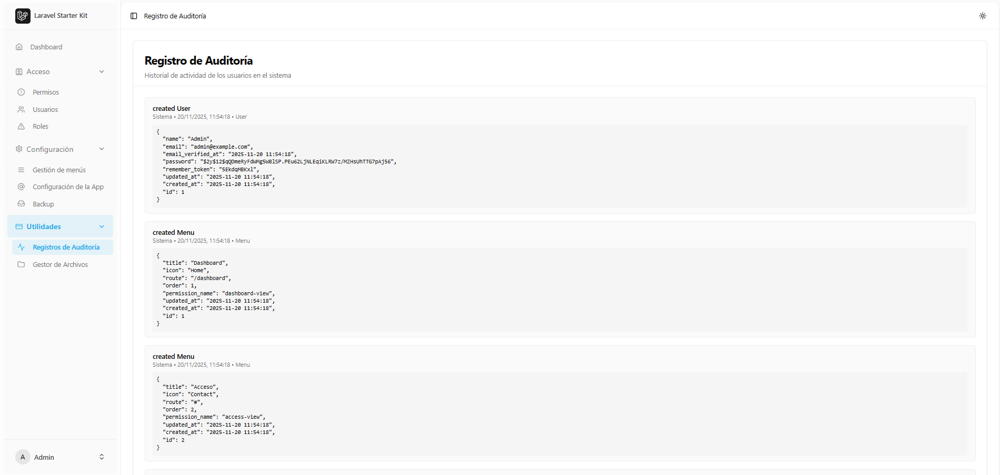
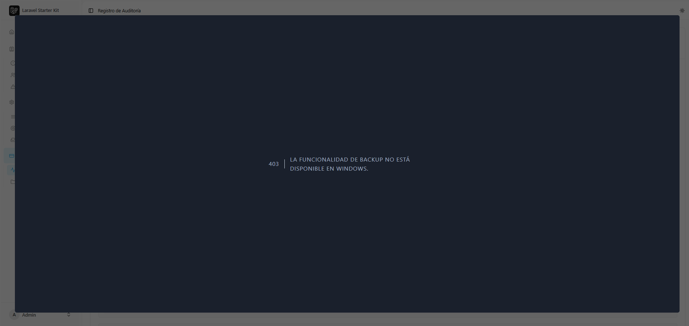

<p align="center"></p>

# 🚀 Laravel 12 + React Starter Kit

Un kit de inicio moderno y flexible, desarrollado con **Laravel 12**, **React (Inertia.js + TypeScript)**, **TailwindCSS** y **ShadCN UI v4**. Diseñado para acelerar el desarrollo de aplicaciones de panel de control seguras, responsivas y personalizables.

---

## ✨ Características

- 🔐 Autenticación completa (inicio de sesión, registro, restablecimiento de contraseña)

- 👥 Gestión de roles y permisos (Spatie Laravel Permission)
- 📂 Barra lateral y menús dinámicos según el rol y los permisos
- 🧩 Gestión de menús mediante arrastrar y soltar (anidados, reordenados)
- ⚙️ Configuración de la aplicación (nombre, logotipo, color del tema, SEO)
- 🎨 Diseño moderno con ShadCN UI v4 y TailwindCSS
- 🌗 Compatibilidad con modo oscuro/claro
- 🔒 Protección de acceso dinámica mediante el middleware `CheckMenuPermission`
- ⚠️ Página de error 403 personalizada (basada en React)
- 💾 Configuración del color principal mediante `--primary` en la base de datos
- 🪪 Registro de auditoría para el seguimiento de la actividad del usuario
- 📦 Sistema de copias de seguridad de la base de datos manual y automático
- 🗂️ Administrador de archivos con operaciones de carpetas y archivos

---

## 🧱 Stack Tecnológico

| Area        | Technology                         |
| ----------- | ---------------------------------- |
| Backend     | Laravel 12                         |
| Frontend    | React 19 + Inertia.js + TypeScript |
| UI Library  | ShadCN UI v4                       |
| CSS Utility | TailwindCSS                        |
| Auth        | Laravel Fortify / Breeze-style     |
| Access Ctrl | Spatie Laravel Permission v5       |
| DBMS        | MySQL / MariaDB                    |
| Layout      | Dynamic Sidebar + Header           |

---

## 🔧 Instalación y configuración

```bash
# Crear proyecto
composer create-project xtrulloreas/larareact12-esp my-app
cd my-app

# Configuración del Backend
composer install

# Configura los ajustes de tu base de datos en .env
php artisan migrate:fresh --seed

# Configuración del Frontend
npm install

# Ejecutar dev
composer run dev
```

Iniciar sesión usando:

```
Email: admin@example.com
Password: password
```

---

## 🚀 Guía de implementación

1. **Compilar frontend para producción**

```bash
npm install
npm run build
```

2. **Ejecutar Laravel en modo Producción**

```bash
php artisan config:cache
php artisan route:cache
php artisan view:cache
```

3. **Establecer permisos de archivo (Linux/MAC)**

```bash
chmod -R 775 storage bootstrap/cache
chown -R www-data:www-data .
```

4. **Escuchar con el servidor web** (Nginx/Apache) apuntando a la carpeta `public/`.

---

## 🖼️ Capturas de pantalla de la aplicación

### 📌 Dashboard (claro)



### 📌 Dashboard (oscuro)



### 📌 Gestión de usuarios



### 📌 Gestión de roles



### 📌 Gestión de permisos


### 📌 Gestión de menús



### 📌 Configuración de la Aplicación



### 📌 Registro de Auditoría



### 📌 Backup de la Base de Datos



### 📌 Gestión de archivos


---

## ✅ Lista de verificación de prueba manual

| Feature                     | Status |
| --------------------------- | ------ |
| Autenticación (Login)       | ✅     |
| CRUD Usuario                | ✅     |
| CRUD Roles & Permisos       | ✅     |
| Menu + Sidebar dinámico     | ✅     |
| Protección de acceso (403)  | ✅     |
| Orden del Menu Drag & Drop  | ✅     |
| Color del tema vía DB       | ✅     |
| Soporta modo oscuro         | ✅     |
| Registro de auditoría       | ✅     |
| Backup de la Base de datos  | ✅     |
| Gestión de archivos         | ✅     |

---

## 🧾 Créditos y origen del proyecto

Este proyecto es un **fork mejorado y traducido al español** del starter kit original creado por el desarrollador tailandés **[@yogijowo](https://github.com/yogijowo)**.

Repositorio original (en tailandés):  
https://github.com/yogijowo/laravel12-react-starterkit

Todo el crédito por la base del sistema, estructura y concepto inicial corresponde al autor original.  

Este fork agrega:

- Traducción completa al español
- Mejoras en UX y UI
- Ajustes para proyectos de Latinoamérica
- Correcciones para compatibilidad en entornos locales como XAMPP/WAMP
- Documentación mejorada en español
- Instalador simplificado vía Packagist

Agradecemos y reconocemos el excelente trabajo del creador original.

---

## 📄 License

Released under the [MIT License](https://opensource.org/licenses/MIT). Feel free to use it for personal or commercial projects.

---

Created with ❤️ by [@yogijowo](https://github.com/yogijowo)
